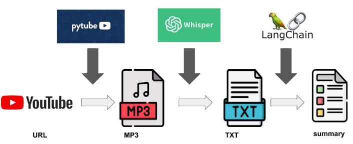

## 기능 정의
`인풋` : 유튜브 url과 OpenAI api키  
`아웃풋` : 요약본


## How to start
```
# .env파일에 OPENAI_API_KEY={본인의 API 키}를 채워주세요.
docker-compose up
```

## 기록
- [LLMSummarizer 프로젝트(1) - 왜 나는 같은 프로젝트를 다시 진행하게 되었을까?](https://watanka.github.io/blog/posts/LLMSummarizer%ED%94%84%EB%A1%9C%EC%A0%9D%ED%8A%B81/)
- [LLMSummarizer 프로젝트(2) CI/CD 구성](https://watanka.github.io/blog/posts/LLMSummarizer%ED%94%84%EB%A1%9C%EC%A0%9D%ED%8A%B82/)
- [LLMSummarizer 프로젝트(3)오디오 데이터 형식을 바꿔서 속도 개선하기](https://watanka.github.io/blog/posts/LLMSummarizer%ED%94%84%EB%A1%9C%EC%A0%9D%ED%8A%B83/)

